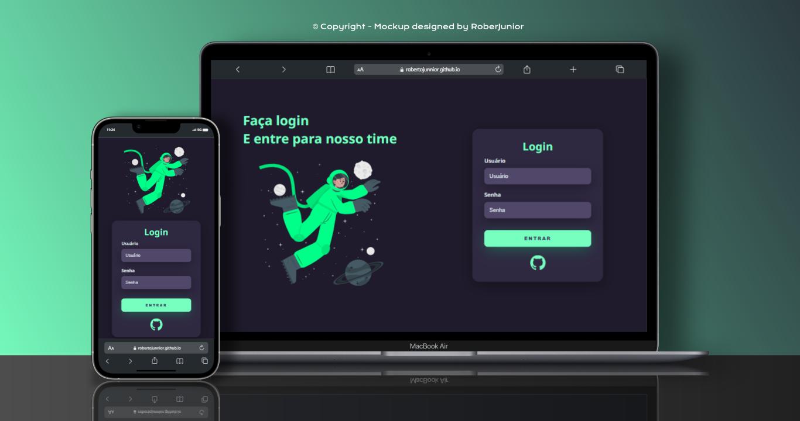

<h1>Projeto Tela de login animada 😁👍🚀🧑‍🚀</h1>

Página de login responsiva, estilizada com algumas media query's e animação criada no site <a href="https://storyset.com/">STORYSET</a> que por sinal é INCRÍVEL 😁, acompanhando vídeo do canal no youtube chamado "Markzuel", você também pode assistir o conteúdo clicando na imagem ao lado 👉 <a target="_blank" href="https://www.youtube.com/watch?v=69-WfrVBli8&ab_channel=Markzuel">.

TECNOLOGIAS que fazem parte deste projeto 🧑‍🚀🚀:

- HTML5;
- CSS3;

Para visualizar o projeto é só <a target="_blank" href="https://robertojunnior.github.io/projeto-tela-de-login/"> Clicar aqui!</a>.  
Ou curta a imagen logo abaixo! 😁😍👍👽

Obrigado pela visita. (●'◡'●) 
 
 

